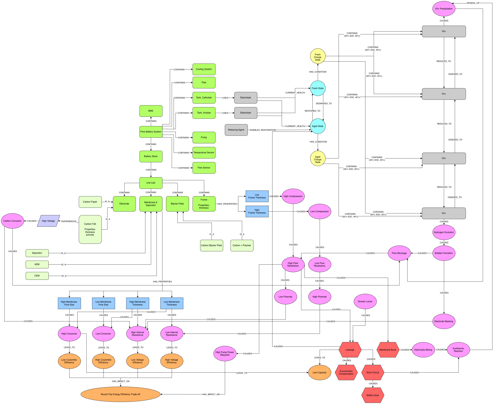

<h1 align="center"> VRFB-mini-GraphRAG </h1>

## Introduction
A PoC GraphRAG system for **Vanadium Redox Flow Battery (VRFB)** performance and failure analysis. 
This project models battery hardware, failure mechanisms, and system performance metrics into a **Neo4j Knowledge Graph**, combined with an LLM for causal root-cause analysis Q&A.

<p align="center">
  
</p>

---

## Project Structure

```text
VRFB-mini-GraphRAG/
├── 01_build_knowledge_graph.ipynb  # Define Neo4j graph database
├── 02_run_graph_rag.ipynb          # Execute graph context retrieval & LLM reasoning Q&A
├── vrfb-kg-schema.png              # Visual diagram of the VRFB causal knowledge graph schema
├── requirements.txt                # Python dependencies
├── .env.example                    # Example configuration file for credentials
└── README.md
```

## Quick Start
**1. Prerequisites**
- Python 3.10+ (Recommended: 3.12)
- A running Neo4j instance (Local Neo4j Desktop or Neo4j AuraDB Free)
- An LLM API Key (e.g., OpenAI / Gemini) depending on your LLM configuration.

**2. Environment Setup**
```sh
# Clone the repository and set up a virtual environment

git clone https://github.com/mong1913/VRFB-mini-GraphRAG.git
cd VRFB-mini-GraphRAG

python3.12 -m venv venv
source venv/bin/activate  # Windows: .\venv\Scripts\activate

pip install --upgrade pip
pip install ipykernel

code .
```
(*If code . gives "command not found", either open the project root directly in VS Code or install the code shell command via Command Palette -> "Shell Command: Install 'code' command in PATH"*)

**3. Configure Credentials**
- Copy .env.example to create your local .env file
- Open .env and input your database & API credentials
```ini
NEO4J_URI = neo4j+s://<database-user>.databases.neo4j.io
NEO4J_USER = database-user
NEO4J_PASSWORD = user_neo4j_password
LLM_URL = 'https://openrouter.ai/api/v1'
LLM_API_KEY = user_api_key
```

**4. Run the Jupyter Notebooks**
- Launch VS Code or Jupyter Lab, and make sure to select the venv kernel (./venv/bin/python) for both notebooks
- Build the Graph (01_build_knowledge_graph.ipynb): Run all cells to establish the Cypher schema and inject VRFB causal relationships into your Neo4j database.
- Execute GraphRAG Q&A (02_run_graph_rag.ipynb): Run all cells to test graph retrieval functions and evaluate LLM-generated root-cause failure analysis.